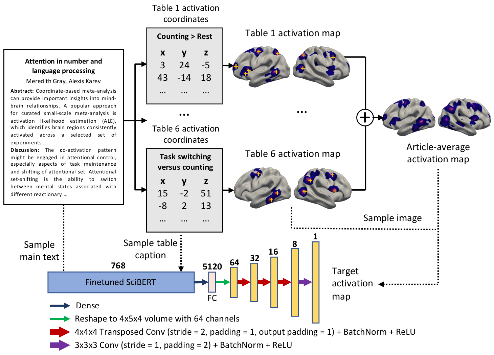
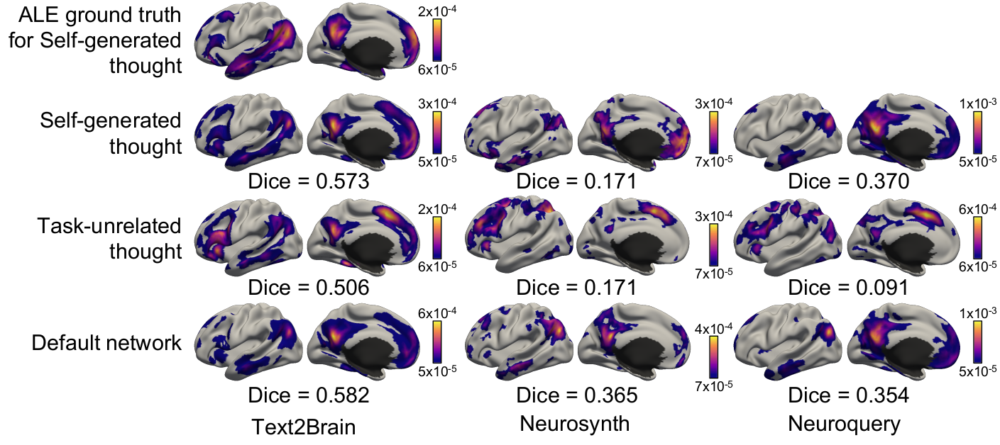

# Text2Brain
Generating brain activation maps from free-form text query

## Reference
Gia H. Ngo, Minh Nguyen, Nancy F. Chen, Mert R. Sabuncu. [**Text2Brain: Synthesis of Brain Activation Maps from Free-form Text Query**](). In International Conference on Medical Image Computing and Computer-Assisted Intervention, 2021

----

## Overview

Text2Brain is a search engine for efficiently combing through rapidly growing wealth of neuroimaging literature brain activation patterns.
It accepts not only keywords but also flexible free-form text queries.
It encodes the text queries using a finetuned Transformer encoder (SciBERT) and generates whole-brain activation maps using a 3D convolutional neural network (CNN).



Demo is available at: [braininterpreter.com](braininterpreter.com)

----

## Outputs for Synonymous Queries

Activation maps predicted by Text2Brain for 3 synonymous queries: `default network`, `self-generated thought`, and `task-unrelated thought`.
The ground-truth activation map is also included in the figure.



----

## Setting Up Text2Brain Project

0. Install [Anaconda](https://docs.anaconda.com/anaconda/install/index.html)
1. Clone this project from Github to some place on your computer (e.g. `/home/gia/text2brain`)
2. Create a Conda environment using the `env.yml` file
    ```bash
        conda env create -f env.yml -n text2brain
    ```
3. Download a checkpoint of the Text2Brain model from [Google Drive](https://drive.google.com/file/d/1IwUGtdbmseTrFU9NAA9gC-k-Iy5hesQs/view?usp=sharing)
4. Extract the downloaded file. You should see a folder named `checkpoints` afterward with the checkpoint in it.
    ```bash
        tar -xzvf text2brain_checkpoint.tar.gz
    ```
5. Move the `checkpoints` folder into the project directory (e.g. `/home/gia/text2brain`)
6. Download the pre-trained uncased SciBERT model using [this link](https://s3-us-west-2.amazonaws.com/ai2-s2-research/scibert/huggingface_pytorch/scibert_scivocab_uncased.tar)
7. Extract the downloaded file.
    ```bash
        tar -xvf scibert_scivocab_uncased.tar
    ```
8. Move the `scibert_scivocab_uncased` folder into the project directory (e.g. `/home/gia/text2brain`)
9. To generate brain activation maps from free-form text query, run `python predict_cpu_only.py <input_query> <output_file>`. For example,
    ```bash
    python predict_cpu_only.py "self-generated thought" prediction.nii.gz
    ```

----

## Bugs and Questions

Please contact Gia at ngohoanggia@gmail.com
